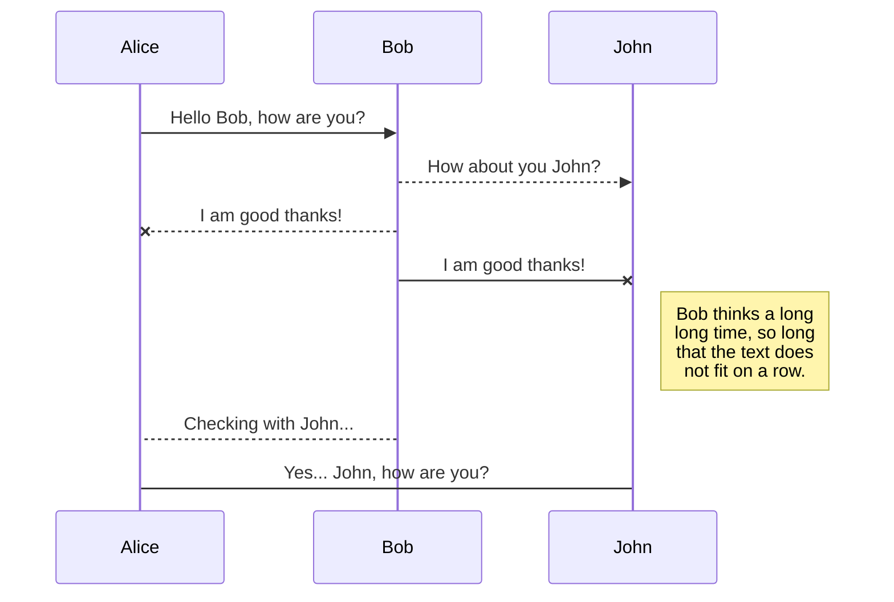
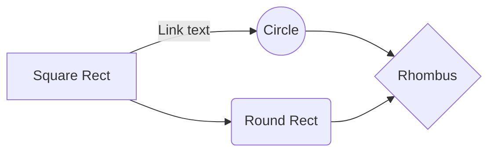

# Estufa Secagem

A grande maioria dos polímeros são higroscópicos ou seja é uma característica de determinados materiais plásticos que diz respeito à capacidade de eles absorverem água. Na industria é uma pratica comum "secar" o material e quanto mais água absorvem, mais tempo permanecem no funil alimentador secador para que sejam desumidificados antes de serem utilizados.

# Versão Anteriores	

No desenvolvimento tive 2 versão a [primeira versão](https://github.com/PrintGreen3d/retiraUmidade-V0.1), usei uma caixa de papelão, secador de cabelo, lm35 e um arduino para fazer o controle de temperatura.

# Versão Atual	
Nesta versão reciclei uma estufa antiga de dentista. A mesma tem pelo menos 19 anos e não existe mais peças de reposição, as poucas que encontrei o preço foi fora do orçamento, decidi remover as peças antigas e instalar um lcd e controle de temperatura e tempo na estufa. 


## Pastas

O Projeto conta com 3 pastas

 - Codigo fonte do arduino;
 - Arquivos OpenSCAD do case do lcd;
 - Arquivos para confecção de uma placa de controle. 

## Componentes
- Arduino Uno/Nano
- Lm35
- Lcd 4 vias i2c
- rtc3231
- Potenciômetro 10k
- Botão

## Video 
```
[](https://www.youtube.com/watch?v=VID)
```


## UML diagrams

You can render UML diagrams using [Mermaid](https://mermaidjs.github.io/). For example, this will produce a sequence diagram:



And this will produce a flow chart:


